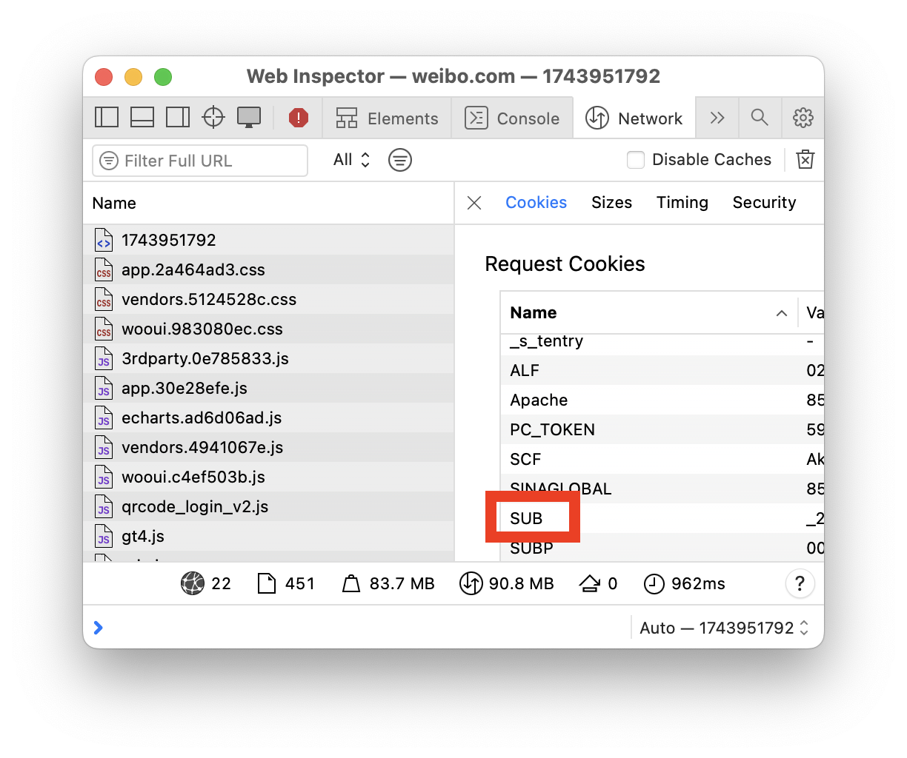

# Nanjing University Course Project

## Run the project

This project is based on Python 3.13, and the project is developed on the macOS system.

### Install the dependencies
```
pip install -r requirements.txt
```

### Set the environment variables

Get the cookie value of the field `SUB` from the browser and set it as an environment variable.


```bash
export COOKIE_SUB='the SUB section of the cookie'
```


### Crawl posts from the Weibo
```bash
python post_crawler.py
```
The crawled data will be saved in the `data/posts.csv` file.

### Crawl comments of the posts
```bash
python comment_crawler.py data/posts.csv
```
The crawled data will be saved in the `data/comments.csv` file.

### More steps...

## Disclaimer

This project is one of the course projects at the Nanjing University.
All data crawled in this project is for research purposes only.
Please do not use it for commercial purposes.